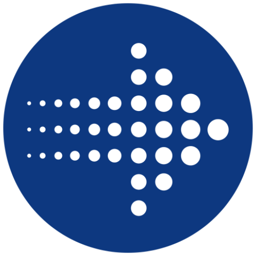
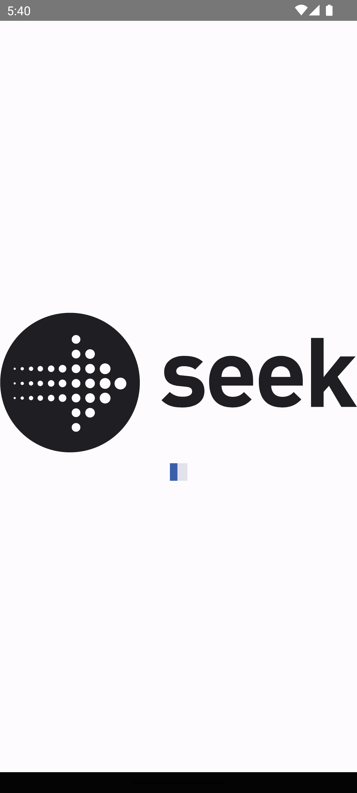
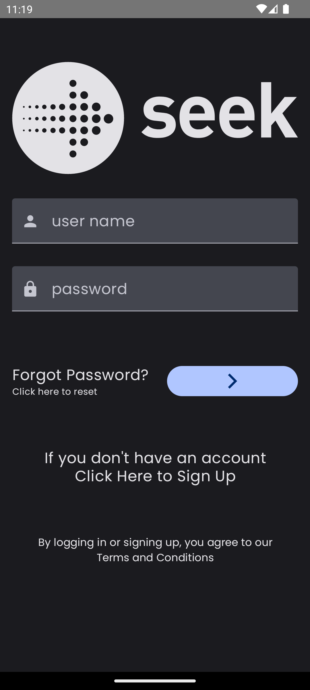
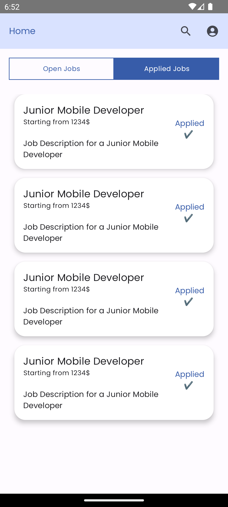
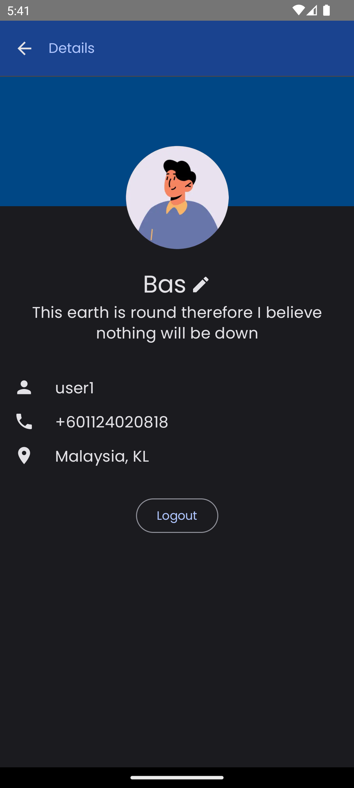

# Seek Demo



SeekDemo is an application developed to simulate job acceptance. This application is designed exclusively for connection to a local host and is developed solely for the purpose of the assignment.

<br />


<p align="center"">
    
    
    
    
</p>

## Features
<br />

### Pages
1. **Splash Screen**: Appears when the app starts.
2. **Login Screen**: Validates user inputs.
3. **Job List Screen**: Features two tabs to display applied and active job appendices.
4. **Job Details Screen**: Provides additional information about the selected job, with the option to apply.
5. **Profile Screen**: Displays user information and allows users to modify their details, such as names.

<br />

### Functionalities
1. **Theme Support**: The app supports two themes (light and dark) and automatically switches based on the system color.
2. **Local Data Storage**: User information and tokens are stored locally within the app.
3. **Pagination**: Supports pagination to load items on the screen.
4. **Tab Differentiation**: Tabs for applying to and viewing open jobs are separated for better UI clarity (required new API changes in JavaScript).
5. **Unit Tests**: Authentication and job functionalities are accompanied by unit tests due to their critical nature.

<br />


```Text

+-------------------+
|      app          |
+-------------------+
|   buildSrc        |
+-------------------+
|   common          |
+-------------------+
|   feature         |
|   +--------------+
|   |   auth        |
|   |   |   data    |
|   |   |   domain  |
|   |   |   presentation
|   |   job         |
|   |   |   details |
|   |   |   collection
|   |   |   data    |
|   |   profile     |
+-------------------+
|   network         |
+-------------------+
|   Storage         |
+-------------------+
|   Theme           |
+-------------------+


```
<br />

### Architecture
1. **Multi-Feature Design**: Utilizes a multi-feature architecture.
2. **Clean Architecture**: Emphasizing proper separation and clean design, although it may be perceived as over-engineering for a small app, it has been adhered to for the purposes of the assignment.
3. **Modules**:
   - **app**: Main app component.
   - **buildSrc**: Contains necessary code to fetch libraries and provide them to other modules.
   - **common**: Contains shared information across modules.
   - **feature**: Includes all app features, further divided into modules like auth, job, and profile, each possibly containing sub-modules (data, domain, presentation).
   - **network**: Includes necessary code for HTTP/HTTPS calls.
   - **storage**: Manages device local storage for the app.
   - **theme**: Includes app themes and colors (light and dark).

<br />

### API
To ensure all requirements are met, certain JavaScript code changes were made to the provided API, including:
1. **New User Data API**: Fetches user data information by authentication token.
2. **Modified Login API**: Returns user information in addition to the token, aiding the profile module and user name change functionality.
3. **Job API Changes**: Supports filtration by positionTitle or appliedJobs only.
4. **API Documentation**: All new APIs and changes are documented in the GraphQL documentation.

<br />

## Notes
1. Some features require API changes, located in the 'backend' folder within the project. Running this folder is necessary to ensure all functionalities work as intended.
2. The priority is to focus on architecture, add as many features as possible within the given time, test them thoroughly, and attempt to cover most ideas.
3. All app functionalities are linked to the API; mocking data has been utilized solely for unit tests.


<br />
<br />


# Developed By

* Bassel Summak - <bassel.su@gmail.com>

* You can also reach me on   [![alt text][2.1]][2]  [![alt text][3.1]][3] 


[2.1]: http://i.imgur.com/P3YfQoD.png
[2]: https://www.facebook.com/Bassel.Su

[3.1]: http://i.imgur.com/tXSoThF.png
[3]: https://twitter.com/Bassel_Summak


